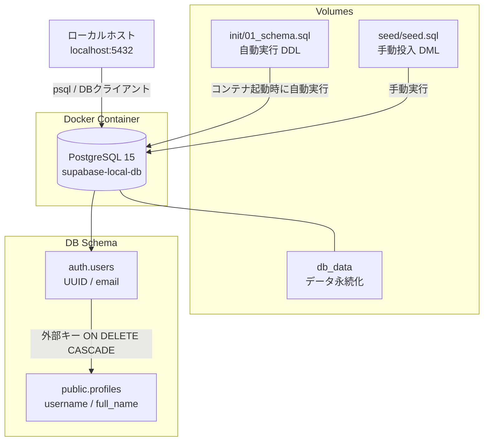

# 🐘 database-docker

[](https://opensource.org/licenses/MIT)
[](https://www.postgresql.org/)
[](https://docs.docker.com/compose/)

> **Docker で Supabase ライクな PostgreSQL 環境をローカルに構築し、SQL・スキーマ設計を学ぶための学習リポジトリ**

---

## 📖 概要

Supabase（PostgreSQL）を模倣したローカルテスト用データベース環境を Docker で構築するリポジトリです。

本番環境の Supabase と同等のデータベース構造（`auth` / `public` スキーマ）をローカルで再現し、SQL による開発・テスト・スキーマ設計の検証を安全に行うことを目的としています。

### なぜ作ったのか

- 本番の Supabase を汚さずに SQL クエリ・スキーマ変更を試したい
- Docker を使ってチーム内で同一の DB 環境を即座に共有したい
- `auth` / `public` スキーマの構造・外部キー・トリガーなど、Supabase の内部設計を学びたい

---

## ✨ 主な特徴

- **Supabase ライクなスキーマ構成**：`auth.users` ↔ `public.profiles` の外部キー・CASCADE 削除を再現
- **自動初期化**：コンテナ起動時に `init/01_schema.sql` が自動実行されテーブルが即座に作成される
- **テストデータ付き**：`seed/seed.sql` で再現性のあるダミーデータをワンコマンドで投入できる
- **ヘルスチェック設定済み**：`pg_isready` による起動確認が組み込まれている

---

## 🛠 技術スタック

| カテゴリ | 技術 |
|:--|:--|
| データベース | PostgreSQL 15 |
| インフラ | Docker / Docker Compose |
| SQL | 標準 SQL（DDL / DML / トリガー） |

---

## 🏗 アーキテクチャ



---

## 🚀 はじめ方

### 前提条件

- [Docker Desktop](https://www.docker.com/products/docker-desktop/) がインストール済みであること

```bash
# インストール確認
docker --version
docker compose version
```

### セットアップ

```bash
# 1. リポジトリをクローン
git clone <repository-url>
cd database-docker

# 2. 環境変数ファイルを作成
cp .env.example .env
# .env を開いて POSTGRES_PASSWORD を設定する

# 3. コンテナを起動（初回は postgres:15 イメージの pull が走る）
docker compose up -d

# 4. 起動確認（STATUS が Up になればOK）
docker compose ps

# 5. データベースに接続
docker compose exec db psql -U postgres -d postgres
```

> ⚠️ `POSTGRES_USER` は必ず `postgres` にすること。他の値にすると接続エラーになる。

### テストデータの投入

```bash
docker compose exec db psql -U postgres -d postgres -f /seed/seed.sql
```

期待出力：

```
INSERT 0 3  -- auth.users
INSERT 0 3  -- public.profiles
 id | email | username | full_name
----+-------+----------+-----------
...
```

---

## 📋 よく使うコマンド

| コマンド | 説明 |
|----------|------|
| `docker compose up -d` | コンテナをバックグラウンドで起動 |
| `docker compose down` | コンテナを停止 |
| `docker compose down -v` | コンテナ＋データを完全削除（リセット） |
| `docker compose ps` | 起動状態を確認 |
| `docker compose logs db` | ログを確認（エラー調査に使う） |
| `docker compose exec db psql -U postgres -d postgres` | DB に接続 |

### スキーマを変更したいとき

`init/01_schema.sql` を編集後、以下でリセット＆再起動する。

```bash
docker compose down -v
docker compose up -d
```

> ⚠️ `-v` を忘れると古いデータが残り、SQL が再実行されない。

---

## 📁 ディレクトリ構成

```
database-docker/
├── docker-compose.yml       # Docker Compose 定義ファイル
├── .env.example             # 環境変数のサンプル（.env は Git 管理外）
├── .gitignore
├── init/
│   └── 01_schema.sql        # 初期スキーマ定義 SQL（コンテナ起動時に自動実行）
├── seed/
│   └── seed.sql             # テストデータ投入 SQL（手動実行）
├── docs/
│   ├── setup.md             # セットアップ詳細手順
│   └── log.md               # 開発ログ・トラブルシューティング記録
└── README.md
```

---

## 🔌 接続情報（デフォルト）

| 項目 | 値 |
|------|----|
| Host | `localhost` |
| Port | `5432` |
| Database | `postgres` |
| User | `postgres` |
| Password | `.env` ファイルを参照 |

---

## ⚠️ 注意事項

- このリポジトリは **SQL・スキーマ設計の練習環境**として使う
- Auth（signUp / signIn / JWT）・OAuth・Storage は使えない。それらが必要なら Supabase CLI を使う → [docs/log.md](./docs/log.md) 参照
- `.env` ファイルは Git にコミットしないこと（`.gitignore` に記載済み）
- 本番データは絶対に使用しない。テスト用ダミーデータのみ使用すること

---

## 📄 ライセンス

このプロジェクトは [MIT License](LICENSE) の下で公開されています。
